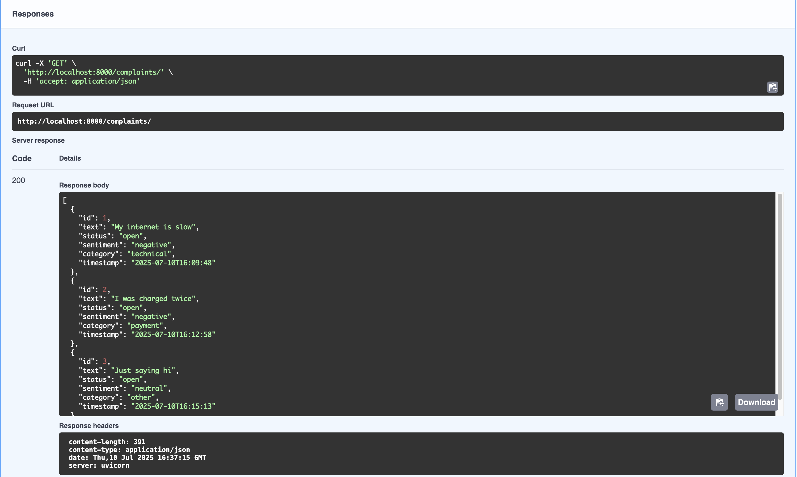
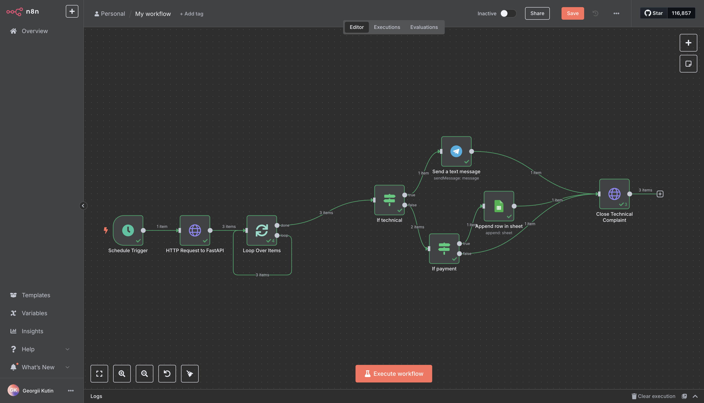
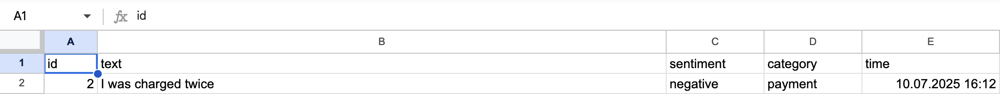
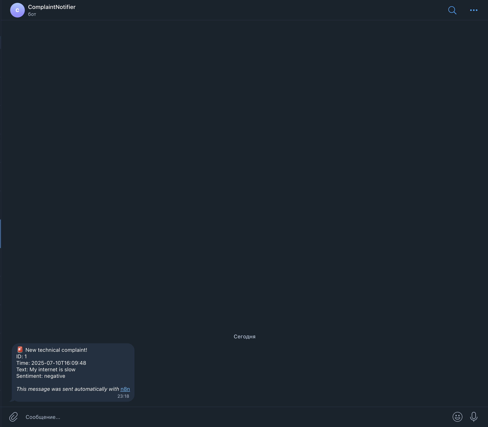

# Complaint Processing API

A FastAPI-based service for collecting customer complaints and enriching them via public APIs:

- **Sentiment Analysis** (APILayer)  
- **Spam Filter** (APILayer)  
- **Geolocation** (ip-api.com)  
- **Category Classification** (OpenAI GPT-3.5 Turbo)  
- **Automation** via n8n (Telegram & Google Sheets)  

## Tech Stack

- Python 3.13, FastAPI  
- Async SQLAlchemy + SQLite + Alembic  
- Pydantic v2 & pydantic-settings  
- Uvicorn ASGI server  
- Docker & Docker Compose  
- n8n 1.101.1  

## Prerequisites

- Python 3.13  
- Docker & Docker Compose  
- git  

## 1. Installation & Dependencies

**Clone the repo and copy .env**
```bash
git clone https://github.com/irefuse3585/complaints-api
cd complaints-api
cp .env.example .env
# Edit the .env file and fill in all required variables
```

**Variant 1: Local deployment (Uvicorn)** 
```bash
python3.13 -m venv venv
source venv/bin/activate
pip install --upgrade pip
pip install -r requirements.txt
alembic upgrade head
python -m uvicorn src.main:app --reload --host 0.0.0.0 --port 8000
```

**Variant 2: Docker deployment**  
```bash
docker compose up --build -d
```

## Environment Variables

All required environment variables are described in the [`.env.example`](.env.example) file.  
Copy it to the root of the repository and fill in your own values:

```env
# .env.example
# Example environment variables for Complaint Service

# SQLite database connection string for async SQLAlchemy (used in application)
DATABASE_URL=sqlite+aiosqlite:///./data/db.sqlite3

# SQLite database connection string for sync SQLAlchemy (used for Alembic migrations)
DATABASE_URL_SYNC=sqlite:///./data/db.sqlite3

# APILayer API key for Sentiment Analysis (get at https://apilayer.com/marketplace/sentiment-analysis-api)
SENTIMENT_API_KEY=your_apilayer_sentiment_key

# API Ninjas key for Spam Check (get at https://api-ninjas.com/api/spamcheck)
SPAM_API_KEY=your_api_ninjas_spam_key

# OpenAI API key for GPT model (get at https://platform.openai.com/api-keys)
OPENAI_API_KEY=your_openai_key

# IP API base URL (no API key required for basic usage)
IP_API_URL=http://ip-api.com/json

# Log level for application logging (DEBUG, INFO, WARNING, ERROR, CRITICAL)
LOG_LEVEL=INFO

# Threshold for spam api(1-10)
threshold=5

# n8n automation settings
N8N_ENCRYPTION_KEY=KeyThatYouMustKeep

# Base URL of the Complaint Service as seen by n8n (Docker service name)
API_URL=http://app:8000
```

**API** at `http://localhost:8000`    

> See `.env.example` for all required FastAPI environment variables.

## 2. API Documentation

**Swagger UI / OpenAPI docs** at `http://localhost:8000/docs`

All endpoints and request/response schemas are documented in the autogenerated Swagger UI:

```
GET http://localhost:8000/docs
```

## 3. cURL Usage Examples

### Technical Complaint

```bash
curl -i -X POST http://localhost:8000/complaints/ \
  -H "Content-Type: application/json" \
  -H "X-Forwarded-For: 203.0.113.45" \
  -d '{"text":"My internet is slow"}'
```

_Response:_

```json

{
  "id": 42,
  "status": "open",
  "sentiment": "negative",
  "category": "technical"
}

```

### Payment Complaint

```bash
curl -i -X POST http://localhost:8000/complaints/ \
  -H "Content-Type: application/json" \
  -d '{"text":"I was charged twice"}'
```

_Response:_

```json
{
  "id": 43,
  "status": "open",
  "sentiment": "negative",
  "category": "payment"
}
```

### Unknown / Other Sentiment

```bash
curl -i -X POST http://localhost:8000/complaints/ \
  -H "Content-Type: application/json" \
  -d '{"text":"Just saying hi"}'
```

_Response:_

```json
{
  "id": 44,
  "status": "open",
  "sentiment": "neutral",
  "category": "other"
}
```

## 4. n8n Automation

1. **Import** `docs/n8n-workflow.json` in n8n UI → **Workflows** → **Import from file**.  
2. **Create Credentials** in n8n UI:  
   - **Telegram Bot**: BotFather token.  
   - **Google Sheets OAuth2**: Service Account JSON key.  
3. **Configure Nodes**:  
   - **HTTP Request** nodes: URL = `{{$env.API_URL + '/complaints/with-text'}}`, query params `status=open`, `since={{$now.minus({ hours: 1 }).toISO()}}`.  
   - **Telegram** node: select your credential, enter Chat ID.  
   - **Google Sheets** node: select your credential, enter Document and Sheet.  
4. **Activate** the workflow and click **Execute Workflow** to test.

> All bot tokens and sheet IDs live in n8n credentials, not in `.env`.

## 5. Spam & Geolocation Logging

Spam filtering and GeoIP lookup occur for each incoming complaint.  
Results (success/failure, error details, and location data) are emitted to the Uvicorn container logs:

```bash
# View logs for Docker service
docker logs complaint_service

# Or view your local console output
```

## 6. Screenshots Demonstration


1. **Unprocessed complaints**  
   

2. **Workflow executed**  
   

3. **Google Sheets**  
   

4. **Message in Telegram**  
   

5. **Closed complaints**  
   

---

## License

Лицензия: [MIT](LICENSE)
